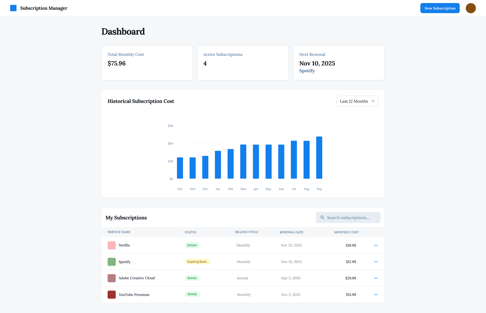
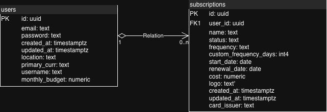

# Subscription Manager



Subscription Manager is an easy-to-use website for users to keep track of all their subscriptions in one place.

## Database Schema



### Overview

Our application uses a PostgreSQL database hosted on Supabase with two main tables: `users` and `subscriptions`.
We also added Row Level Security (RLS) policies to the schema to ensure data isolation and security.

### Tables

#### Users Table

Stores user account information and preferences.

**Fields:**

- `id` (UUID, PK): Unique identifier for each user, auto-generated
- `email` (TEXT, UNIQUE): User's email address for authentication
- `password` (TEXT): Hashed password for secure authentication
- `created_at` (TIMESTAMPTZ): Account creation timestamp
- `updated_at` (TIMESTAMPTZ): Last profile update timestamp (auto-updated via trigger)
- `location` (TEXT): User's location for timezone/regional settings
- `primary_curr` (TEXT): User's preferred currency for subscription costs
- `username` (TEXT): Display name for the user
- `monthly_budget` (NUMERIC): User's monthly subscription budget limit

**Indexes:**

- `idx_users_email`: Optimizes email lookups during authentication

#### Subscriptions Table

Stores subscription details for each user.

**Fields:**

- `id` (UUID, PK): Unique identifier for each subscription
- `user_id` (UUID, FK): References users.id, establishes one-to-many relationship
- `name` (TEXT): Name of the subscription service
- `status` (TEXT): Subscription status (Active, Cancelled, etc.)
- `frequency` (TEXT): Billing frequency (Monthly, Yearly, Custom)
- `custom_frequency_days` (INT): Number of days for custom billing cycles
- `start_date` (DATE): When the subscription began
- `renewal_date` (DATE): Next renewal/billing date
- `cost` (NUMERIC): Subscription cost per billing cycle
- `logo` (TEXT): URL or path to subscription service logo
- `card_issuer` (TEXT): Payment method information
- `created_at` (TIMESTAMPTZ): Record creation timestamp
- `updated_at` (TIMESTAMPTZ): Last update timestamp (auto-updated via trigger)

**Indexes:**

- `idx_subscriptions_user_id`: Optimizes queries filtering by user
- `idx_subscriptions_renewal_date`: Optimizes renewal date lookups for notifications

**Relationships:**

- Many-to-One with users table (ON DELETE CASCADE - deleting a user removes all their subscriptions)

## How to test our app (SPECIFICALLY FOR TESTING - THE FULL LOCAL SETUP IS BELOW)

### Prerequisites

- Node.js (v16 or higher)
- npm

### 1. Clone the repository

```bash
git clone https://github.com/jonathanxue235/subscription-manager
cd subscription-manager
```

### 2. Add .env files to frontend and backend

- Add the respective .env files in the correct folder

### 3. Run setup script

This script installs dependencies for both frontend and backend, creates .env files, and optionally starts the servers.

```bash
chmod +x setup.sh  # Make script executable
./setup.sh
```

## How to run locally

### Prerequisites

- Node.js (v16 or higher)
- npm
- Supabase account

### 1. Clone the repository

```bash
git clone https://github.com/jonathanxue235/subscription-manager
cd subscription-manager
```

### 2. Backend Setup

```bash
cd backend
npm install
```

Create a `.env` file in the `backend` directory:

```bash
cp .env.example .env
```

Edit `backend/.env` and fill in your values:

- `PORT`: Choose a port (default: 5001)
- `SUPABASE_URL`: Your Supabase project URL
- `SUPABASE_ANON_KEY`: Your Supabase anon/public key
- `JWT_SECRET`: A random secret string for JWT tokens (generate a secure random string)
- `NODE_ENV`: Environment mode (development/production)
- `CORS_ALLOWED`: Comma-separated list of allowed origins (default: http://localhost:3000)

### 3. Frontend Setup

```bash
cd ../frontend
npm install
```

Create a `.env` file in the `frontend` directory:

```bash
cp .env.example .env
```

Edit `frontend/.env` and fill in your values:

- `REACT_APP_BACKEND_URL`: Your backend URL (e.g., `http://localhost:5001`)

### 4. Database Setup

1. Go to your Supabase project dashboard
2. Navigate to SQL Editor
3. Run the SQL script from `backend/schema.sql` to create the users and subscriptions tables

### 5. Start the Development Servers

**Terminal 1 - Backend:**

```bash
cd backend
npm start
```

**Terminal 2 - Frontend:**

```bash
cd frontend
npm start
```

The frontend will run on http://localhost:3000

The backend will run on http://localhost:5001 (or your configured PORT)
